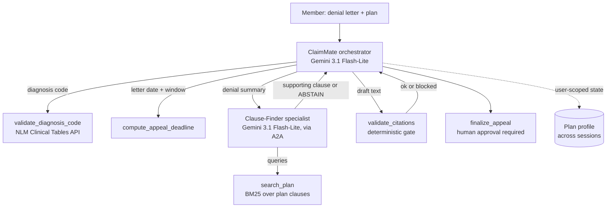

# Architecture

## Flow

1. The orchestrator extracts the denial facts from the letter.
2. It validates the diagnosis code against a live public API.
3. It computes the appeal deadline with deterministic date math.
4. It delegates to the Clause-Finder, which retrieves candidate clauses and either returns a supporting clause with an exact quote or abstains.
5. On support, the orchestrator drafts an appeal citing only returned clauses.
6. The citation gate checks every cited clause exists in the plan and blocks any that do not.
7. The orchestrator shows the draft and requests approval before finalizing.

## Mapping to the course

| Concept | Where it lives |
|---|---|
| Agents and orchestration | `agent.py`, `clause_finder.py` |
| Tools, external API, retrieval | `tools.py` (ICD-10, deadline, plan search) |
| Agent-to-agent (A2A) | `a2a_server.py`, `RemoteA2aAgent` toggle in `agent.py` |
| Memory and context | user-scoped state (`user:plan_profile`), persistent sessions |
| Evals and guardrails | `evals/run_eval.py`, `guardrails.py`, citation gate |
| Deploy and observability | `adk web` traces, optional `adk deploy cloud_run` |

## Why two agents

The split is by responsibility. The orchestrator drives the seven step workflow and the drafting. The Clause-Finder is a focused specialist whose only job is the hard reasoning step: decide whether dense policy language supports a claim, or abstain when it does not. Keeping it as its own agent means the hard reasoning is isolated, can be served over A2A, and has its own independently configurable model. Both agents run on Gemini 3.1 Flash-Lite, which keeps the whole project on the free tier and still scores 100% on the eval suite, because the deterministic BM25 retrieval does the searching and the model only has to judge and quote. When stronger reasoning is wanted, point the Clause-Finder at a Pro model (set `CLAIMMATE_PRO_MODEL=gemini-3-pro-preview` with billing enabled) without changing anything else.

## Safety design

The stochastic model output is wrapped by deterministic checks: a citation gate that cannot be argued with, and an approval step that holds the appeal until the member says yes. The agent is built to cite a real clause or abstain. It is not built to be convincing at any cost.
